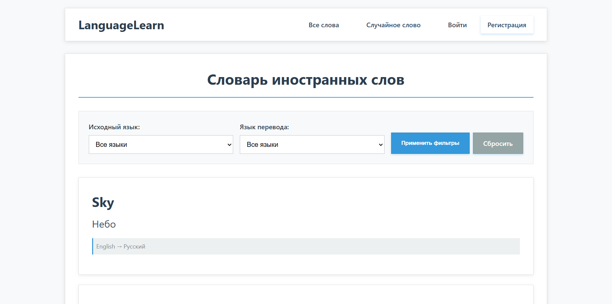

# 🗣️ Vocabulary Learning Website


Веб-приложение для изучения иностранных слов, созданное на Django.

## ✨ Возможности

- 📚 Просмотр списка слов с переводами
- 🎯 Случайное слово при каждом обновлении
- 🔍 Детальная информация о словах
- ❤️ Добавление слов в избранное
- 🔧 Фильтрация по языкам
- 👤 Регистрация и авторизация

## 📸 Скриншоты

### Главная страница


### Страница слова


## 🚀 Быстрый старт

### Предварительные требования

- Python 3.8 или выше
- pip (менеджер пакетов Python)

### Установка

1. **Клонируйте репозиторий:**
```bash
git clone https://github.com/ваш-username/vocabulary-learning.git
cd vocabulary-learning